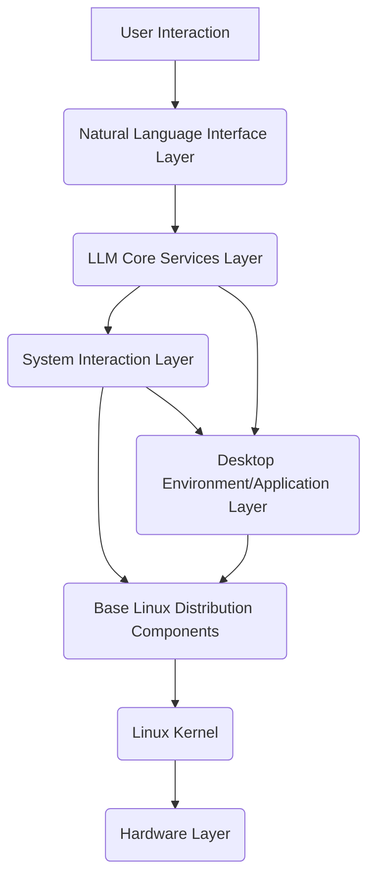

# Technical Architecture for an LLM-Powered Linux Distribution

## 1. Executive Summary

This document outlines a proposed technical architecture for an LLM-powered Linux distribution, a concept inspired by the idea of integrating Large Language Models (LLMs) deeply into the operating system to enhance user interaction, system management, and overall computing experience. The goal is to create a Linux environment where natural language serves as a primary interface, enabling intuitive control and intelligent automation.

## 2. Vision and Core Principles

The vision for this LLM-powered Linux distribution is to transform the traditional operating system into an intelligent, adaptive, and highly intuitive computing environment. The core principles guiding this architecture include:

*   **Natural Language First:** Prioritizing natural language as the primary mode of interaction for system commands, queries, and automation.
*   **Contextual Awareness:** The OS should understand user intent and system state to provide proactive assistance and relevant information.
*   **Intelligent Automation:** Leveraging LLMs to automate complex system administration tasks, troubleshooting, and software management.
*   **Modularity and Extensibility:** Designing the architecture to allow for easy integration of new LLMs, tools, and functionalities.
*   **Security and Control:** Implementing robust mechanisms to ensure the security and integrity of the system, with clear guardrails for LLM actions.
*   **Performance Optimization:** Ensuring that LLM integration does not significantly degrade system performance, with a focus on efficient local inference.

## 3. High-Level Architecture Overview

The LLM-powered Linux distribution will be built upon a stable, existing Linux base, augmented with several key LLM-specific components. The architecture can be conceptualized in layers:

*   **Hardware Layer:** The physical computing resources (CPU, GPU, RAM, storage).
*   **Linux Kernel:** The core of the OS, managing hardware and providing fundamental system services.
*   **Base Linux Distribution Components:** Standard GNU tools, init system, package manager, file system, etc.
*   **LLM Core Services Layer:** Dedicated services responsible for LLM inference, model management, and function calling orchestration.
*   **System Interaction Layer (API/Tooling):** A controlled interface exposing system functionalities to the LLM.
*   **Natural Language Interface Layer:** Components that process user natural language input and present LLM-generated responses.
*   **Desktop Environment/Application Layer:** Traditional graphical interfaces and applications, enhanced by LLM capabilities.

## 4. Detailed Architectural Components

### 4.1. Base Linux Distribution Selection

To ensure stability, broad hardware compatibility, and access to a vast software repository, the LLM-powered Linux distribution will likely be based on a well-established distribution. Candidates include:

*   **Ubuntu/Debian:** Known for their stability, large communities, and extensive package repositories. Tools like Cubic or Live-build can facilitate customization.
*   **Fedora/RHEL:** Offers cutting-edge features and strong enterprise support. Kickstart can be used for automated installations.
*   **Arch Linux:** Provides a rolling release model and high customizability, suitable for users who prefer to build their system from the ground up, though it requires more manual effort.

**Recommendation:** Start with **Ubuntu LTS (Long Term Support)** as the base. Its widespread adoption, robust package management (APT), and active community provide a solid foundation for development and future maintenance. Customization can be achieved using tools like Cubic for initial ISO creation.

### 4.2. LLM Core Services Layer

This layer is central to the LLM functionality, managing the LLM models and their interaction with the rest of the system.

*   **LLM Inference Engine:** Responsible for loading and running LLM models efficiently. This component will leverage optimized libraries for local inference.
    *   **Technologies:** `Ollama` for simplified local LLM deployment and management, `GGML`/`GGUF` for CPU-optimized inference, `ONNX Runtime` or `TensorRT` for GPU acceleration.
    *   **Functionality:** Handles model loading, tokenization, inference execution, and response generation.
*   **Model Management Service:** Manages different LLM models (e.g., smaller specialized models for quick tasks, larger general-purpose models for complex queries). It will handle model downloading, versioning, and switching.
    *   **Functionality:** Provides APIs for model selection, loading/unloading, and status monitoring.
*   **Function Calling Orchestrator (Agentic Core):** This is the brain of the LLM-OS, responsible for interpreting LLM-generated function calls and orchestrating their execution through the System Interaction Layer.
    *   **Technologies:** Custom Python services leveraging frameworks like `LangChain` or `LlamaIndex` for agentic capabilities, tool definition, and prompt management.
    *   **Functionality:** Receives structured function call requests from the LLM, validates them, and dispatches them to the appropriate system tools or APIs. It also handles the return values and feeds them back to the LLM for further reasoning.

### 4.3. System Interaction Layer (API/Tooling)

This layer provides a secure and controlled interface for the LLM Core Services to interact with the underlying Linux system. It acts as a set of "tools" that the LLM can "use" to perform actions.

*   **System API Wrapper:** A collection of well-defined APIs that expose specific Linux functionalities to the LLM. These APIs will be granular and secure.
    *   **Examples:** APIs for file system operations (read, write, delete), process management (start, stop, list), network configuration (get IP, set DNS), package management (install, remove, update), user management, and system status queries.
    *   **Implementation:** Could be implemented as a set of Python scripts or C/C++ binaries exposed via a gRPC or D-Bus interface.
*   **Command Execution Sandbox:** A sandboxed environment for executing LLM-generated shell commands. This is crucial for security, preventing the LLM from executing arbitrary or malicious commands.
    *   **Technologies:** `chroot`, `namespaces` (Linux containers), `seccomp` filters, or dedicated sandboxing tools.
    *   **Functionality:** Restricts the capabilities of executed commands, limits access to sensitive resources, and logs all executed commands for auditing.
*   **System Event Monitor:** Monitors system events (e.g., new hardware detected, low disk space, process crashes) and feeds relevant information to the LLM Core Services for proactive responses.
    *   **Technologies:** `inotify` for file system events, `systemd-journald` for logs, `Netlink` for network events.

### 4.4. Natural Language Interface Layer

This layer handles the user-facing natural language interaction.

*   **Natural Language Processor (NLP) Frontend:** Receives user input (text or speech), performs initial parsing, and sends it to the LLM Core Services.
    *   **Functionality:** Speech-to-text conversion (if voice input is supported), basic intent recognition, and input sanitization.
*   **Response Generator/Renderer:** Receives LLM-generated responses and renders them to the user.
    *   **Functionality:** Text-to-speech conversion (if voice output is supported), formatting text responses for display in a terminal or GUI, and potentially generating visual elements based on LLM instructions.
*   **Context Manager:** Maintains conversational context and user preferences, allowing for more natural and continuous interactions with the LLM.
    *   **Functionality:** Stores recent interactions, user-specific configurations, and environmental variables.

### 4.5. Desktop Environment/Application Layer Enhancements

Existing desktop environments and applications will be enhanced to integrate with the LLM Core Services.

*   **LLM-Aware Shell:** A modified shell (e.g., `bash`, `zsh`) that can intercept user commands, send them to the LLM for interpretation, and execute the LLM-generated commands. This could be `nl-sh` or a similar custom implementation.
*   **Desktop Assistant Integration:** A system-wide desktop assistant (similar to a virtual assistant) that leverages the LLM for various tasks, such as answering questions, launching applications, managing files, and providing contextual help.
*   **Application Plugins:** Plugins or extensions for popular applications (e.g., file managers, text editors, web browsers) that allow them to leverage LLM capabilities for tasks like smart search, content generation, or automation.

## 5. Development Phases and Milestones

Building an LLM-powered Linux distribution is a multi-phase project. The following outlines a potential development roadmap:

### Phase 1: Proof of Concept (PoC) - Natural Language Shell

*   **Goal:** Demonstrate basic natural language interaction with the Linux shell.
*   **Key Tasks:**
    *   Select a base Linux distribution (Ubuntu LTS).
    *   Set up a development environment.
    *   Integrate a local LLM (e.g., using Ollama) capable of generating shell commands.
    *   Develop a basic Natural Language Processor (NLP) frontend.
    *   Implement a simple Function Calling Orchestrator to execute LLM-generated commands.
    *   Implement a basic command execution sandbox.
    *   **Milestone:** User can issue natural language commands (e.g., "list all files in my home directory") and the system executes the corresponding shell command.

### Phase 2: Enhanced System Interaction and Automation

*   **Goal:** Expand the LLM's ability to interact with various system functionalities beyond basic shell commands.
*   **Key Tasks:**
    *   Develop a comprehensive System API Wrapper for file system, process management, and network configuration.
    *   Enhance the Function Calling Orchestrator to support a wider range of tools and complex multi-step actions.
    *   Implement basic system event monitoring to enable proactive LLM responses.
    *   **Milestone:** LLM can perform tasks like "install Firefox," "check network status," or "find processes using the most memory."

### Phase 3: Desktop Environment Integration and User Experience

*   **Goal:** Integrate LLM capabilities into the graphical desktop environment and improve overall user experience.
*   **Key Tasks:**
    *   Develop a desktop assistant application that leverages the LLM Core Services.
    *   Integrate LLM capabilities into core desktop applications (e.g., file manager, settings).
    *   Refine the Natural Language Interface for smoother conversational interaction.
    *   Implement Text-to-Speech (TTS) and Speech-to-Text (STT) for voice interaction.
    *   **Milestone:** Users can interact with the OS via voice commands and receive intelligent assistance within the GUI.

### Phase 4: Advanced Features and Optimization

*   **Goal:** Implement advanced features, optimize performance, and harden security.
*   **Key Tasks:**
    *   Implement advanced model management (e.g., dynamic model loading, fine-tuning).
    *   Further optimize LLM inference for various hardware configurations.
    *   Strengthen security measures, including advanced sandboxing and access control.
    *   Develop a robust update mechanism for LLM models and system components.
    *   **Milestone:** A stable, performant, and secure LLM-powered Linux distribution ready for broader testing.

## 6. Security Considerations

Integrating LLMs into an operating system introduces significant security challenges. A robust security framework must be in place:

*   **Principle of Least Privilege:** LLM Core Services and their associated tools should only have the minimum necessary permissions to perform their functions.
*   **Input Validation and Sanitization:** All user input and LLM-generated commands must be rigorously validated and sanitized to prevent injection attacks or unintended actions.
*   **Sandboxing:** Critical system operations triggered by the LLM must be executed within isolated and restricted environments.
*   **User Confirmation for Sensitive Actions:** For any potentially destructive or sensitive action (e.g., deleting files, changing system settings, installing software), explicit user confirmation should be required.
*   **Auditing and Logging:** Comprehensive logging of all LLM interactions, tool calls, and system modifications for auditing and debugging purposes.
*   **Model Security:** Protecting LLM models from adversarial attacks, data poisoning, and unauthorized access.

## 7. Future Work and Research Directions

*   **Self-Healing and Proactive Maintenance:** Leveraging LLMs to detect, diagnose, and automatically resolve system issues.
*   **Personalized OS:** Developing adaptive interfaces and functionalities based on individual user behavior and preferences.
*   **Multi-Modal Interaction:** Integrating vision and other modalities for richer interaction (e.g., LLM understanding screen content).
*   **Edge AI/TinyML for LLMs:** Exploring highly optimized, small LLMs for deployment on resource-constrained devices.
*   **Formal Verification of LLM Actions:** Research into methods for formally verifying the safety and correctness of LLM-generated system actions.

**Author:** Manus AI
**Date:** July 1, 2025

